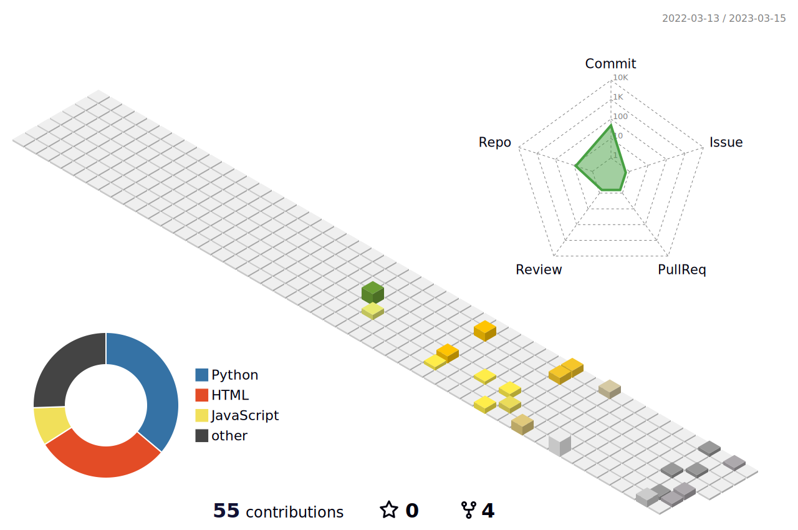

<head>
    <meta http-equiv="Content-Type" content="text/html; charset=UTF-8"/>
    <link rel="import" href="https://vinogl.github.io/Resume/CV.html" id="cHeader" />
    
</head>
<body>
    
</body>

